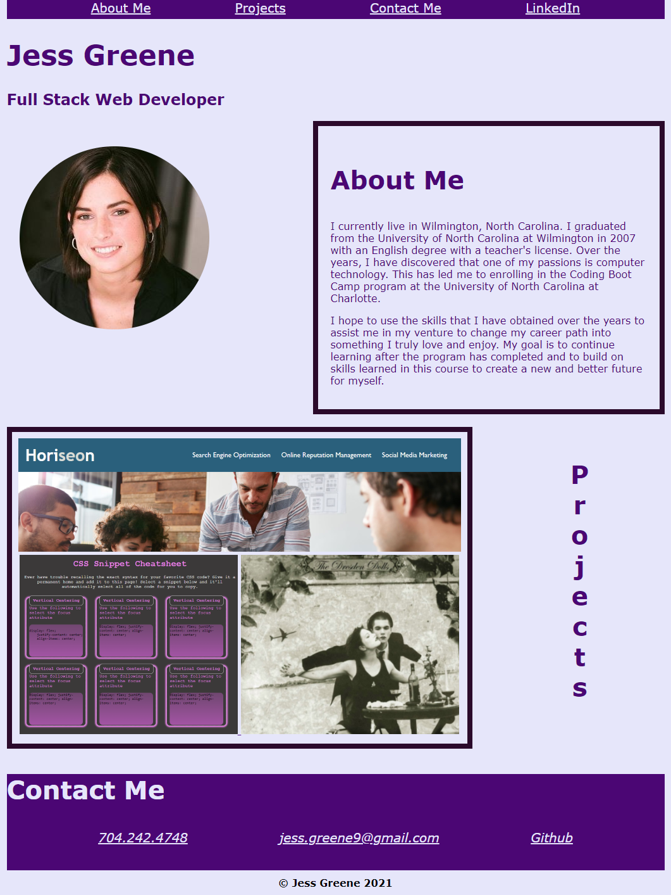

# jess-greene-portfolio
A portfolio of work showcasing my skills.

## Table of contents
- [Deployed Website](#deployedwebsite)
- [Description](#description)
- [Screenshots](#screenshots)
- [Tech/Framework](#tech/framework)
- [License](#license)

## Deployed Website

https://jessgreene9.github.io/jess-greene-portfolio/

## Description

This is a professional portfolio highlighting the skills of the web developer's background. Within the portfolio, one will find background information, projects the developer has completed, and contact information. A recent picture and the developer's name is included. 

This site contains user friendly anchor links in the navigation bar. When one clicks on the links at the top of the page, they are brought to that corresponding section on the page. When the images in the "projects" section are clicked, a new tab will open deploying that web application. 

This webpage is responsive and will adjust to a smaller view-point for readability. The contact links at the bottom of the page will allow a potential employer to access the developer's Github repositories as well as be able to click the email link and automatically be brought to a new email message.

## Screenshots

## Tech/Framework

VS Code

## License

